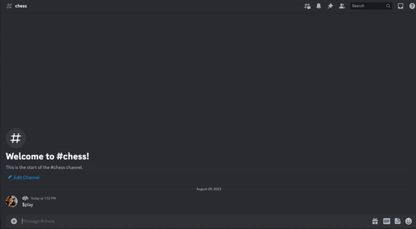

# Discord Chess Bot

Welcome to the Discord Chess Bot! This bot enables users to play chess against various chess engines, including Stockfish, Komodo, Supra, and a custom Minimax-based chess AI.

## Table of Contents

- [Overview](#overview)
- [Demo](#demo)
- [Features](#features)
- [Getting Started](#getting-started)
  - [Prerequisites](#prerequisites)
  - [Installation](#installation)
  - [Usage](#usage)
- [Contact](#contact)

## Overview

The Discord Chess Bot is designed to provide users with an engaging chess-playing experience directly within a Discord server. Whether you're a beginner looking for practice or an experienced player seeking a challenge, this bot offers a variety of chess engines to test your skills against.

## Demo

## Features

- Play chess against different chess engines:
  - Stockfish NNUE
  - Komodo 13
  - Supra 28
  - Custom Minimax-based AI
- Configure difficulty level via engine selection.
- Interactive and user-friendly interface.
- Move validation and error handling to ensure a smooth gaming experience.

## Getting Started

Follow these steps to set up and use the Discord Chess Bot on your server.

### Prerequisites

- A Discord account
- Permissions to add bots to a server you manage

### Invite Link
https://discord.com/api/oauth2/authorize?client_id=1136113670053711956&permissions=84992&scope=bot

### Installation

1. Invite the bot to your server using the provided invite link above.
2. Set up the desired configuration and permissions for the bot.
3. The bot will join the server and be ready to use.

### Usage

1. Use `$play` to select your engine to and begin a new match.
2. Make your moves using standard algebraic notation (e.g., `e4` or `Nc3`).
3. The bot will provide responses and continue the game.
4. Use `$help` to access the list of available commands and their usage.

## Contact

For any questions, suggestions, or support, you can reach me by email:

Email: derrick.higgins@outlook.com
